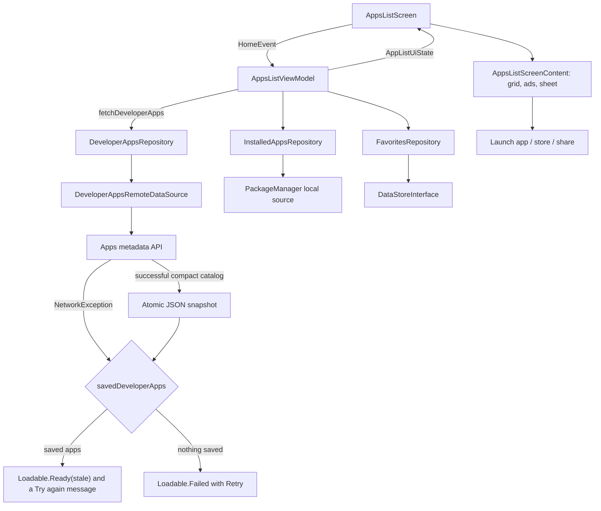

# `:sample:feature:apps` Logic Graph

## Purpose

The developer's app catalogue: listing, details, favorites, and install state.

## Owns

- `DeveloperAppsRepository`, `InstalledAppsRepository`, `FavoritesRepository` and their `Default`
  implementations.
- `DeveloperAppsRemoteDataSource`, which owns Ktor requests and DTO decoding, and throws a
  `NetworkException` for an error status.
- `DeveloperAppsLocalDataSource`, which persists the last successfully downloaded compact
  catalogue as an atomic JSON file, plus `InstalledAppsLocalDataSource` for PackageManager access.
- `AppsListViewModel`, `AppListUiState`, `HomeEvent`, `AppsListScreen` with its stateless
  `AppsListScreenContent`, the detail sheet, and the native-ad placement in the list.
- Localized app-catalogue strings, and `ui/mappers/AppsListErrorMappers.kt`, which gives each
  failure the shared `toUiText` text or the feature's fallback.
- `AppsListRoute`, this feature's tab key.
- The Get it on Google Play badge the detail sheet shows.
- The random-app button, declared by `AppsListScreenContent` with `ScaffoldFabs` so the tab's
  scaffold draws it; it scales out while there is no app to open.
- Filtering the grid by the tab's search field (`LocalShellSearch`): an app matches by name,
  package or description, after the filter chips.

## Does not own

- Its registration as a tab, done by `:sample:app`'s `appGraph`.
- Widget rendering, owned by [`:sample:widget`](../../widget/README.md), which reads this module's
  repository.

## Depends on

- `:sample:core:analytics`, `:sample:core:datastore` and `:sample:integration:ads`.
- [`:library:apptoolkit`](../../../library/apptoolkit/README.md) for ad slots, `core.ui.screen`,
  `networkCall`, `storageCall` and Ktor.

## Used by

- `:sample:widget` for the catalogue, and `:sample:app` for DI and the navigation graph.

## Flow chart

```mermaid
flowchart TD
    Screen[AppsListScreen] -->|HomeEvent| VM[AppsListViewModel]
    VM -->|fetchDeveloperApps| Developer[DeveloperAppsRepository]
    Developer --> Remote[DeveloperAppsRemoteDataSource]
    Remote --> Api[Apps metadata API]
    Api -->|successful compact catalog| Cache[Atomic JSON snapshot]
    Api -->|NetworkException| Fallback{savedDeveloperApps}
    Cache --> Fallback
    Fallback -->|saved apps| Stale["Loadable.Ready(stale) and a Try again message"]
    Fallback -->|nothing saved| Failed[Loadable.Failed with Retry]
    VM --> Installed[InstalledAppsRepository]
    Installed --> Packages[PackageManager local source]
    VM --> Favorites[FavoritesRepository]
    Favorites --> Store[DataStoreInterface]
    VM -->|AppListUiState| Screen
    Screen --> Content[AppsListScreenContent: grid, ads, sheet]
    Content --> Actions[Launch app / store / share]
```

## Architectural decisions

- The remote catalog is authoritative; the atomic JSON snapshot exists for offline/stale fallback
  and is replaced only after a successful decode.
- Corrupt snapshots are deleted and treated as misses so malformed cached data cannot create a
  permanent failure loop.
- Installed state and favorites have separate repositories because PackageManager and preferences
  are independent sources with different lifetimes.
- Ad interleaving and action/chip models are presentation transformations and remain outside the
  source-neutral repositories.
- Package-name copying uses the Toolkit's `ClipboardRepository`, as About does. The Apps toast is
  shown only when the system does not confirm copies itself, on Android 12L and earlier. Android
  13 and later use only the system confirmation.
- The repositories return data or throw: `NetworkException` through `networkCall`, and
  `StorageException` through `storageCall` for the saved catalogue and the favorites. The feature
  throws no exceptions of its own.
- The ViewModel, not the repository, falls back to the saved catalogue, because only it knows to
  mark the copy stale and say why. A failed favorite update keeps the grid and shows a message.
- Opening an app needs a `Context`, so the screen does it. The random-app button sets
  `AppListUiState.randomAppToOpen`, and the screen clears it with `HomeEvent.RandomAppOpened`.
- The favorite callback reads the state at tap time, so it keeps one identity and a favorite
  change does not recompose every card.

## Installed-package metadata

AndroidInstalledAppsLocalDataSource shares core common's getVersionMetadata lookup with Issue
Reporter, then maps into the feature's existing AppVersionInfo. Blank names, package visibility,
and unavailable version behavior are unchanged; the feature still owns install-state decisions.

## Public contracts

- The three repositories, `AppsListViewModel`, `AppsListScreen`, `AppsListRoute`,
  `AppInfo`/`AppSummary`/`AppDetails`.

## Internal implementations

- Remote DTO mapping, local cache-model mapping and serialization, ad interleaving, and
  PackageManager inspection.

## Source of truth and failure behavior

The remote endpoint remains authoritative. Each successful compact-catalogue response atomically
replaces the local JSON snapshot; a failed write is reported to Crashlytics and does not fail the
fetch. `fetchDeveloperApps` throws when the download fails, and `savedDeveloperApps` reads the
snapshot without the network, so the screen and the widget both stay useful offline. Corrupt
snapshots are deleted and treated as cache misses.

## Current risks

The module applies the Kotlin serialization plugin because its DTOs and its route are
`@Serializable`. Compiling
without it succeeds and fails only at decode time, so the plugin has to stay even though nothing
about the source makes the dependency visible.

## Migration notes

`AppsListViewModel` used to take six pass-through use cases wrapping these three repositories. It
now
takes the repositories; the use cases added a duplicated breadcrumb and nothing else.

The screen moved from `core.ui.base` to `core.ui.screen`. `DeveloperAppsRepository` no longer
returns `DataState`: its calls are `suspend` and throw, and `AppErrors` and `HomeAction` are gone.
`AppsListScreen()` takes no parameters; it pads by `contentPadding()` and reads the window size
class itself. The ViewModel no longer takes a `DispatcherProvider`.
