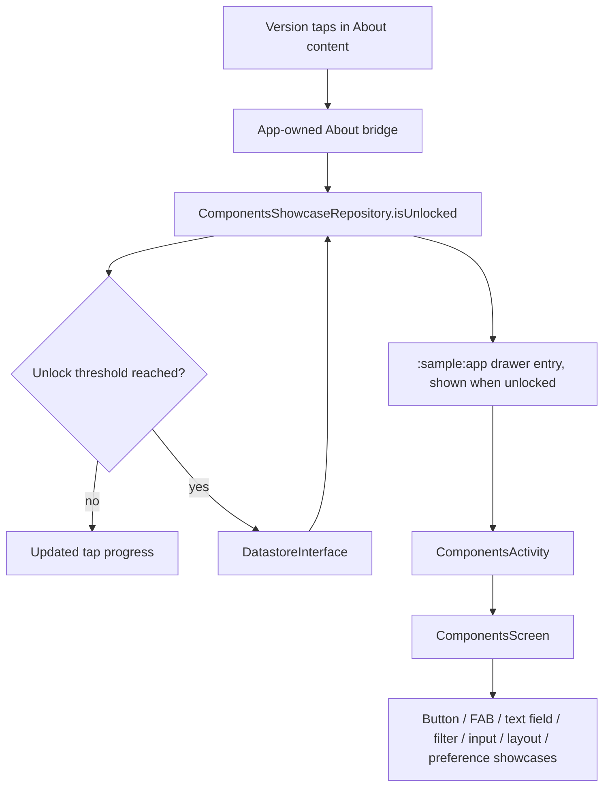

# `:sample:feature:components` Logic Graph

## Purpose

The hidden components showcase and the unlock gesture that reveals it.

## Owns

- The concrete `ComponentsShowcaseRepository`, which owns the unlock flag.
- `ComponentsActivity`, `ComponentsScreen`, and the unlock threshold behavior.
- Localized strings for the component showcase.
- The `GeneralTextField` gallery: one card per variant, including the error state and the Markdown
  editor. The text typed into it is the showcase's own scratch state and stays inside the section.
- The animation playground for bundled DesignSystem AVDs: a replay-mode menu, a Loop checkbox, and
  the menu that chooses whether a loop starts right away or on the first tap. Changing a control
  resets preview state; previews animate only on taps until a loop is started.

## Does not own

- Where the unlock gesture is performed. The app composition root supplies that bridge to the
  reusable About screen.
- Drawer rendering, owned by [`:sample:core:shell`](../../core/shell/README.md).

## Depends on

- `:sample:core:navigation`, `:sample:core:datastore`, and `:sample:core:analytics`.
- [`:library:apptoolkit`](../../../library/apptoolkit/README.md) for the screen and state contracts.

## Used by

- `:sample:app`, which composes the feature and launches its standalone activity.

## Flow chart

## Architectural decisions

- This UI showcase intentionally has no `domain` package. It only observes a persisted flag through
  one repository, so a pass-through use case would add no business logic or reusable operation.
- The app owns the cross-feature gesture bridge and the drawer entry, while this feature owns the
  threshold rule and the persisted unlock state it exposes as `isUnlocked`.
- The shell never sees this feature: it renders whatever drawer items the app hands it.
- A concrete repository is sufficient because there is one DataStore-backed implementation and no
  module boundary that requires substitution.

## Public contracts

- `ComponentsShowcaseRepository` and `ComponentsActivity`. The drawer entry that reveals the
  showcase is assembled by `:sample:app`, which reads `isUnlocked`.

## Internal implementations

- Tap counting and the showcase screen content.

## Current risks

The unlock gesture remains deliberately hidden in the About experience. Moving or removing that
host bridge changes discoverability even though the feature itself remains independent.

## Migration notes

`ComponentsShowcaseRepository` is concrete because the sample has one DataStore implementation. It
serializes threshold writes and is the sole owner of the persisted unlock mutation.
