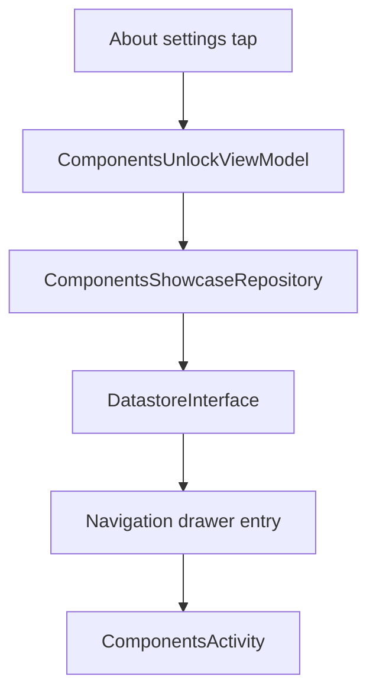

# `:sample:feature:components` Logic Graph

## Purpose

The hidden components showcase and the unlock gesture that reveals it.

## Owns

- `ComponentsShowcaseRepository` and its default implementation, owning the unlock flag.
- `ComponentsActivity`, `ComponentsScreen`, `ComponentsUnlockViewModel` and its contracts.
- `ComponentsNavigationBuilder`.

## Does not own

- Where the unlock gesture is performed. That is the About settings content in
  [`:sample:feature:settings`](../settings/README.md), which drives this module's ViewModel.
- The drawer entry that opens the showcase, owned by [`:sample:feature:home`](../home/README.md).

## Depends on

- `:sample:core:navigation`, `:sample:core:datastore`, `:sample:core:ui`.
- [`:library:apptoolkit`](../../../library/apptoolkit/README.md) for the screen and state contracts.

## Used by

- `:sample:feature:settings` (unlock gesture), `:sample:feature:home` (drawer entry), `:sample:app` (DI).

## Flow chart

## Public contracts

- `ComponentsShowcaseRepository`, `ComponentsUnlockViewModel`, `ComponentsActivity`,
  `ComponentsNavigationBuilder`.

## Internal implementations

- Tap counting and the showcase screen content.

## Current risks

Two other feature modules depend on this one, which is more inbound coupling than a leaf feature
usually carries. Both edges are real — the gesture is in settings and the entry point is in the
drawer — but they mean this module cannot be removed without touching both.

## Migration notes

`ComponentsShowcaseRepository` was created when `UnlockComponentsShowcaseUseCase` was removed. The
use case forwarded one call to `DatastoreInterface`, so deleting it outright would have left a
ViewModel holding a data source with no repository between them.
