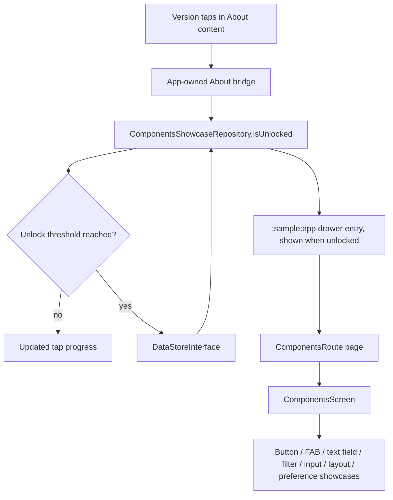

# `:sample:feature:components` Logic Graph

## Purpose

The hidden components showcase and the unlock gesture that reveals it.

## Owns

- The concrete `ComponentsShowcaseRepository`, which owns the unlock flag.
- `ComponentsRoute`, `ComponentsScreen`, and the unlock threshold behavior.
- Localized strings for the component showcase.
- The article app bar demo: `ArticleBarShowcase` opens `ArticleDemoRoute`, a made-up article
  (`ArticleDemoScreen`) that declares `ScaffoldArticleTopBar`, without a brand or with
  `components_article_brand`, a multicoloured vector mark drawn for this sample.
- The `GeneralTextField` gallery: one card per variant, including the error state and the Markdown
  editor. The text typed into it is the showcase's own scratch state and stays inside the section.
- The animation playground for bundled DesignSystem AVDs: a replay-mode menu, a Loop checkbox, and
  the menu that chooses whether a loop starts right away or on the first tap. Changing a control
  resets preview state; previews animate only on taps until a loop is started.
- The snackbar examples, inside the buttons section rather than a section of their own: each group
  of buttons shows one kind through `rememberScaffoldSnackbars()`. Standard buttons show a plain
  message, tonal ones a message with an Undo action, outlined ones the error style with Retry, text
  and icon buttons an icon with colours of its own, and the size groups a snackbar the screen draws
  itself through `content`.

## Does not own

- Where the unlock gesture is performed. The app composition root supplies that bridge to the
  reusable About screen.
- The page registration and the drawer entry, both in `:sample:app`'s `appGraph`, and drawer
  rendering, owned by [`:library:shell`](../../../library/shell/README.md).

## Depends on

- `:sample:core:datastore` and `:sample:core:analytics`.
- [`:library:apptoolkit`](../../../library/apptoolkit/README.md) for the screen and state contracts.

## Used by

- `:sample:app`, which registers `ComponentsScreen` as a page of its graph.

## Flow chart

```mermaid
flowchart TD
    About[Version taps in About content] --> Bridge[App-owned About bridge]
    Bridge --> Repo[ComponentsShowcaseRepository]
    Repo --> Counter{Unlock threshold reached?}
    Counter -->|no| State[Updated tap progress]
    Counter -->|yes| Store[DataStoreInterface]
    Store --> Repo[ComponentsShowcaseRepository.isUnlocked]
    Repo --> Drawer[":sample:app" drawer entry, shown when unlocked]
    Drawer --> Page[ComponentsRoute page]
    Page --> Screen[ComponentsScreen]
    Screen --> Sections[Button / FAB / text field / filter / input / layout / preference showcases]
```

## Architectural decisions

- This UI showcase intentionally has no `domain` package. It only observes a persisted flag through
  one repository, so a pass-through use case would add no business logic or reusable operation.
- The app owns the cross-feature gesture bridge and the drawer entry, while this feature owns the
  threshold rule and the persisted unlock state it exposes as `isUnlocked`.
- The shell never sees this feature: it renders whatever drawer entries the app's graph declares.
- A concrete repository is sufficient because there is one DataStore-backed implementation and no
  module boundary that requires substitution.

## Public contracts

- `ComponentsShowcaseRepository`, `ComponentsRoute` and `ComponentsScreen`. The drawer entry that reveals the
  showcase is assembled by `:sample:app`, which reads `isUnlocked`.

## Internal implementations

- Tap counting and the showcase screen content.

## Current risks

The unlock gesture remains deliberately hidden in the About experience. Moving or removing that
host bridge changes discoverability even though the feature itself remains independent.

## Migration notes

`ComponentsShowcaseRepository` is concrete because the sample has one DataStore implementation. It
serializes threshold writes and is the sole owner of the persisted unlock mutation.
