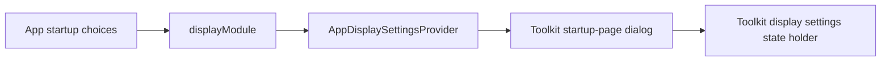

# `:sample:feature:display` Logic Graph

## Purpose

Customizes the Toolkit display settings with the sample's startup-page selector.

## Owns

- `AppDisplaySettingsProvider`, which offers the startup-page dialog.
- `displayModule`, which binds `DisplaySettingsProvider` and derives the startup choice count
  from the app's qualified `STARTUP_VALUES` binding.

## Does not own

- Display settings UI and preference persistence, owned by
  [`:library:feature:display`](../../../library/feature/display/README.md).
- Available startup destinations, owned by `:sample:app`.
- Toolkit module ordering, owned by `:sample:core:apptoolkit`.

## Depends on

- `:library:feature:display` for its provider contract, selector, and exported dependencies.

## Used by

- `:sample:app`, which passes `displayModule` to `appToolkitHostModules`.

## Flow chart

## Architectural decisions

Display has a separate sample feature so future display customization has an existing owner.
The provider uses Toolkit UI and callbacks, while the app supplies destination choices through a
shared qualifier. No sibling feature dependency is required.

## Public contracts

- `displayModule` and `AppDisplaySettingsProvider`.

## Current risks

The app's startup values and display names must describe the same destinations. The provider
reports confirmed selections; Toolkit code continues to own persistence.
