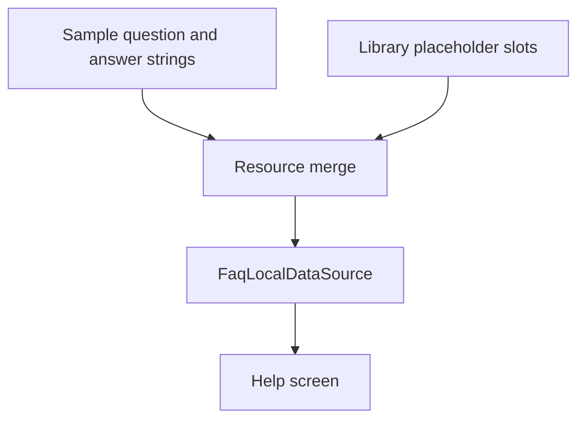

# `:sample:feature:faq` Logic Graph

## Purpose

Carries the sample application's FAQ content: nine questions and nine answers, translated across
every supported locale.

## Owns

- The sample's `question_*` and `summary_preference_faq_*` string resources, in all 25 locales.

## Does not own

- The FAQ mechanism (repository, data sources, use case, `QuestionCard`), owned by
  [`:library:feature:faq`](../../../library/feature/faq/README.md).
- The Help screen that renders the questions, owned by `:library:feature:help`.

## Depends on

- [`:library:feature:faq`](../../../library/feature/faq/README.md), whose empty placeholder
  resources these strings answer.

## Used by

- `:sample:app`, which must contain this module for the overrides to reach the merged resources.

## Flow chart

## Architectural decisions

- This module is resource-only and deliberately has no Kotlin. Its whole job is to answer the
  library's placeholder names, so a new or reworded question is a one-module change that touches no
  code and no other feature.
- The content lives here rather than in `:sample:core:apptoolkit` because that module is the host's
  toolkit wiring. FAQ copy shares nothing with it beyond having been convenient to put there.

## Public contracts

- The `question_1` to `question_9` and `summary_preference_faq_1` to `summary_preference_faq_9`
  string resources.

## Internal implementations

- None; the module holds no code.

## Current risks

The resource names are a contract with `:library:feature:faq`. Renaming one here silently falls back
to the library's empty placeholder rather than failing the build.
