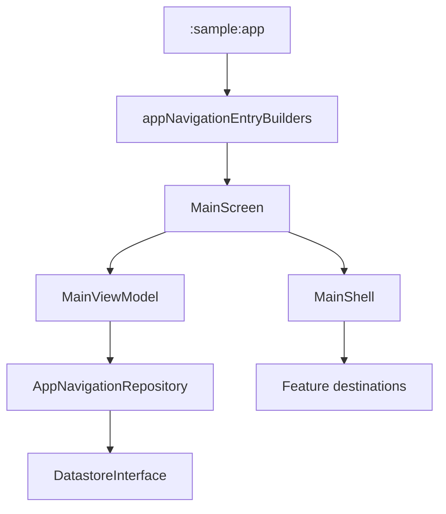

# `:sample:feature:home` Logic Graph

## Purpose

The application shell: the scaffold, navigation drawer, bottom bar and FAB that host every
destination.

## Owns

- `MainScreen` and `MainShell`, the drawer, the FAB, and the changelog dialog trigger.
- `MainViewModel` and its contracts.
- `AppNavigationRepository`, which builds the drawer items and hides the showcase entry until it is
  unlocked.

## Does not own

- Which destinations exist. `MainScreen` receives its entry builders as a parameter; `:sample:app`
  supplies them.
- `MainActivity`, which lives in `:sample:app` because it is the launcher activity and the place
  where the feature set is named.

## Depends on

- `:sample:feature:components` for `ComponentsActivity`, the drawer's showcase target.
- `:sample:core:navigation`, `:sample:core:datastore`, `:sample:core:ui`.
- [`:library:apptoolkit`](../../../library/apptoolkit/README.md) for the toolkit's own destinations,
  top bar and drawer content.

## Used by

- `:sample:app`.

## Flow chart

## Public contracts

- `MainScreen(entryBuilders)`, `MainViewModel`, `AppNavigationRepository`.

## Internal implementations

- Scene selection, drawer/bottom-bar state, random-app handler plumbing.

## Current risks

The shell knows the toolkit's standalone activities (settings, help, support) by class, so adding a
toolkit destination that opens as an activity means editing this module.

## Migration notes

`MainScreen` used to call `appNavigationEntryBuilders` directly, which imported the apps and tiles
features. Taking the builders as a parameter is what lets those features stay leaves; the only
sibling this module still names is `:sample:feature:components`.
