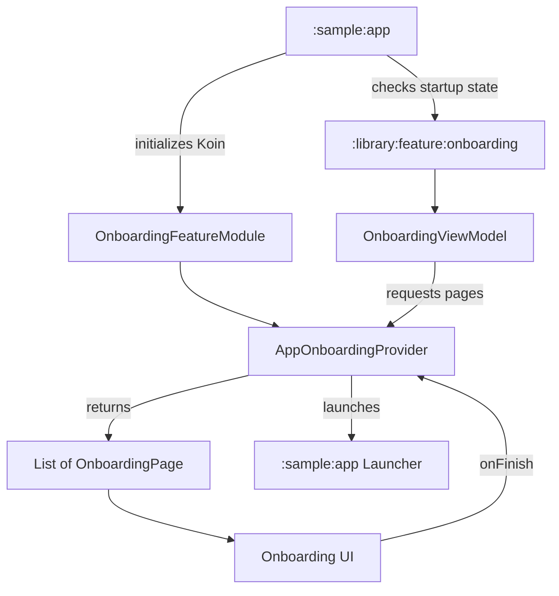

# `:sample:feature:onboarding` Logic Graph

## Purpose

Handles the application's first-launch onboarding experience by providing specific pages and
completion logic to the App Toolkit's onboarding infrastructure.

## Owns

- `AppOnboardingProvider`, which defines the set of pages shown to the user (Welcome,
  Personalization, Theme, Features, Crashlytics, Finish).
- Stable onboarding page identifiers in `domain/models`.
- Onboarding-specific strings and keys.
- `OnboardingFeatureModule`, which connects the sample's provider to the library's
  `OnboardingViewModel`.

## Depends on

- `:sample:core:navigation` for navigation keys.
- `:sample:core:common` for shared utilities.
- [`:library:apptoolkit`](../../../library/apptoolkit/README.md) for the core onboarding UI and
  logic.

## Used by

- `:sample:app` as a feature dependency.

## Flow chart

## Architectural decisions

- The sample module intentionally has no `data` package: persistence and its repository
  implementation are owned by `:library:feature:onboarding`; this module only supplies host page
  configuration and DI composition.
- **Decoupled Completion**: The provider uses the package manager to find the launcher activity on
  completion, avoiding a hard dependency on `:sample:app`.
- **Toolkit Integration**: This module demonstrates the "Provider Pattern" where the sample app
  supplies implementation details to a generic library feature via Koin injection.
