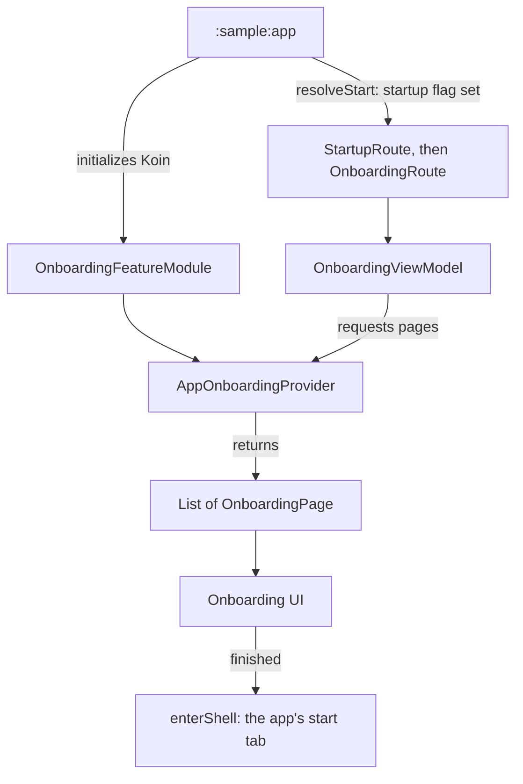

# `:sample:feature:onboarding` Logic Graph

## Purpose

Handles the application's first-launch onboarding experience by providing specific pages and
completion logic to the App Toolkit's onboarding infrastructure.

## Owns

- `AppOnboardingProvider`, which defines the set of pages shown to the user (Welcome,
  Personalization, Theme, Features, Crashlytics, Finish). The Crashlytics page is
  `FirebaseOnboardingPage` from `:library:feature:diagnostics`.
- Stable onboarding page identifiers in `domain/models`.
- Onboarding-specific strings and keys.
- `OnboardingFeatureModule`, which connects the sample's provider to the library's
  `OnboardingViewModel`.

## Depends on

- `:sample:core:datastore`.
- [`:library:apptoolkit`](../../../library/apptoolkit/README.md) for the core onboarding UI and
  logic.

## Used by

- `:sample:app` as a feature dependency.

## Flow chart

```mermaid
flowchart TD
    App[":sample:app"] -->|initializes Koin| Module[OnboardingFeatureModule]
    Module --> Provider[AppOnboardingProvider]
    App -->|resolveStart: startup flag set| Start[StartupRoute, then OnboardingRoute]
    Start --> ViewModel[OnboardingViewModel]
    ViewModel -->|requests pages| Provider
    Provider -->|returns| Pages[List of OnboardingPage]
    Pages --> UI[Onboarding UI]
    UI -->|finished| Enter[enterShell: the app's start tab]
```

## Architectural decisions

- The sample module intentionally has no `data` package: persistence and its repository
  implementation are owned by `:library:feature:onboarding`; this module only supplies host page
  configuration and DI composition.
- **Completion stays in the Toolkit**: finishing onboarding enters the shell in the same activity,
  so the provider supplies pages only and knows nothing of `:sample:app`.
- **Toolkit Integration**: This module demonstrates the "Provider Pattern" where the sample app
  supplies implementation details to a generic library feature via Koin injection.
