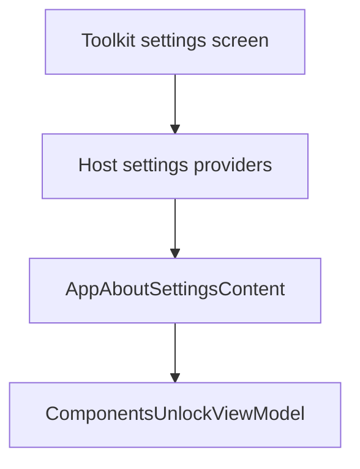

# `:sample:feature:settings` Logic Graph

## Purpose

The host's settings providers: what the sample contributes to the toolkit's settings screens.

## Owns

- `AppSettingsProvider`, `AppAboutSettingsProvider`, `AppDisplaySettingsProvider`,
  `AppAdvancedSettingsProvider`, `AppPrivacySettingsProvider`.
- `AppAboutSettingsContent`, including the tap gesture that unlocks the components showcase.
- Host settings constants.

## Does not own

- The settings screens themselves, owned by [
  `:library:feature:settings`](../../../library/feature/settings/README.md).
  This module only fills in the provider contracts that module exposes.
- The unlock flag, owned by [`:sample:feature:components`](../components/README.md).

## Depends on

- `:sample:feature:components` for `ComponentsUnlockViewModel`, driven by the About tap gesture.
- `:sample:core:datastore`, `:sample:core:ui`.
- [`:library:apptoolkit`](../../../library/apptoolkit/README.md) for the provider contracts.

## Used by

- `:sample:app`, which binds the providers into Koin.

## Flow chart

## Public contracts

- The five provider implementations and `AppAboutSettingsContent`.

## Internal implementations

- Version-string formatting and the debug/release label.

## Current risks

The About content carries the components-unlock gesture, so a change to the showcase can require a
change here. The alternative — putting the gesture in the components module — would invert the
dependency without removing it, because the gesture has to live on the About screen.
