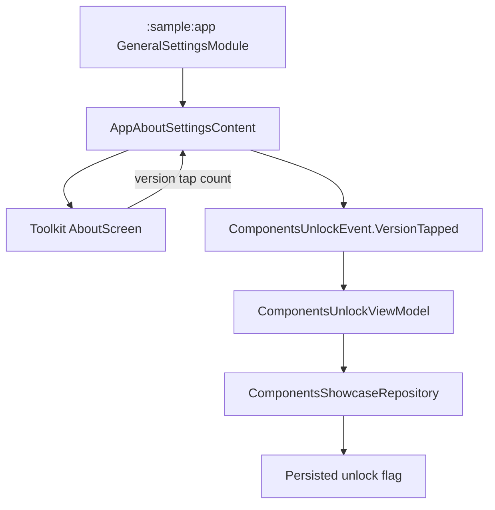

# `:sample:feature:settings` Logic Graph

## Purpose

The sample-only About content that connects the toolkit About screen to the hidden components
showcase unlock flow.

## Owns

- `AppAboutSettingsContent`, including the tap gesture that unlocks the components showcase.

## Does not own

- The settings screens themselves, owned by [
  `:library:feature:settings`](../../../library/feature/settings/README.md).
- Host settings/startup provider implementations and their localized resources, owned by
  [`:sample:core:apptoolkit`](../../core/apptoolkit/README.md).
- The unlock flag, owned by [`:sample:feature:components`](../components/README.md).

## Depends on

- `:sample:feature:components` for `ComponentsUnlockViewModel`, driven by the About tap gesture.
- [`:library:apptoolkit`](../../../library/apptoolkit/README.md) for the provider contracts.

## Used by

- `:sample:app`, whose general-settings Koin module supplies this content for the About content key.

## Flow chart

## Architectural decisions

- This feature is intentionally a thin UI bridge: the provider belongs to the reusable host adapter,
  while unlock state belongs to the components feature.
- The About composable receives the tap callback instead of depending on sample code, preserving the
  toolkit feature's reusability.
- No repository or data source is introduced here because the module owns no state or business rule.

## Public contracts

- `AppAboutSettingsContent`.

## Internal implementations

- Callback wiring between the toolkit About screen and the components unlock ViewModel.

## Current risks

The About content carries the components-unlock gesture, so a change to the showcase can require a
change here. The alternative, putting the gesture in the components module, would invert the
dependency without removing it, because the gesture has to live on the About screen.
