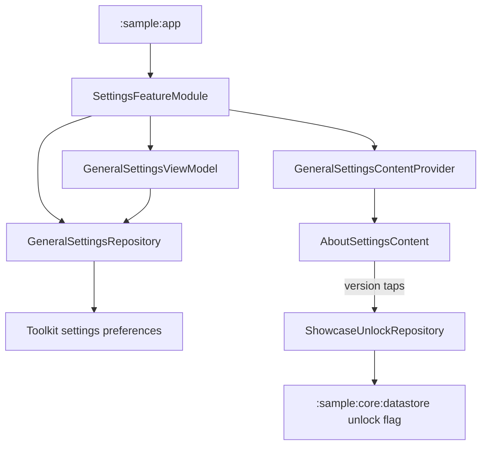

# `:sample:feature:settings` Logic Graph

## Purpose

The settings surface this app adds on top of the toolkit: its General Settings bindings, the
About content, and the hidden version-tap gesture that surface hosts.

## Owns

- The sample binding for `GeneralSettingsRepository` and `GeneralSettingsViewModel`.
- `GeneralSettingsContentProvider`, bound with this app's `AboutSettingsContent`.
- `ShowcaseUnlockRepository`: the version-tap threshold and the write that persists the unlock.

## Does not own

- The settings screens themselves, owned by [
  `:library:feature:settings`](../../../library/feature/settings/README.md).
- Host settings/startup provider implementations and their localized resources, owned by
  [`:sample:core:apptoolkit`](../../core/apptoolkit/README.md).
- The showcase the gesture reveals, owned by
  [`:sample:feature:components`](../components/README.md), which only reads the same flag.
- The startup-screen choices, composed by `:sample:app`, which is the only module that may name
  every top-level destination.

## Depends on

- [`:library:apptoolkit`](../../../library/apptoolkit/README.md) for the provider contracts.
- [`:sample:core:datastore`](../../core/datastore/README.md) for the persisted unlock flag.

## Used by

- `:sample:app`, whose general-settings Koin module supplies this content for the About content key.

## Flow chart

## Architectural decisions

- This sample adapter intentionally has no `domain` package. Its only app-owned operation is a
  single repository mutation, so adding a forwarding use case would not isolate reusable logic.
- This feature binds sample runtime dependencies to reusable settings implementations.
- The About gesture lives with the Settings surface that hosts it. It reaches the Components
  showcase through the shared flag in `:sample:core:datastore` rather than through the feature, so
  neither feature depends on its sibling and no registration contract is needed.
- Exactly one module may bind `GeneralSettingsContentProvider`. A second, unqualified binding of
  the same type silently overrides this one and takes the About content with it.

## Public contracts

- `settingsModule`, `AboutSettingsContent`, `ShowcaseUnlockRepository`.

## Internal implementations

- General Settings repository and ViewModel construction, and the tap-threshold rule.

## Current risks

This module wraps library-owned settings implementations. Changes to their constructor contracts
must be reflected in this binding module.

The unlock threshold and the reader of the flag sit in different modules. Changing the flag's
meaning here without checking `:sample:feature:components` will silently change what that feature
shows.
