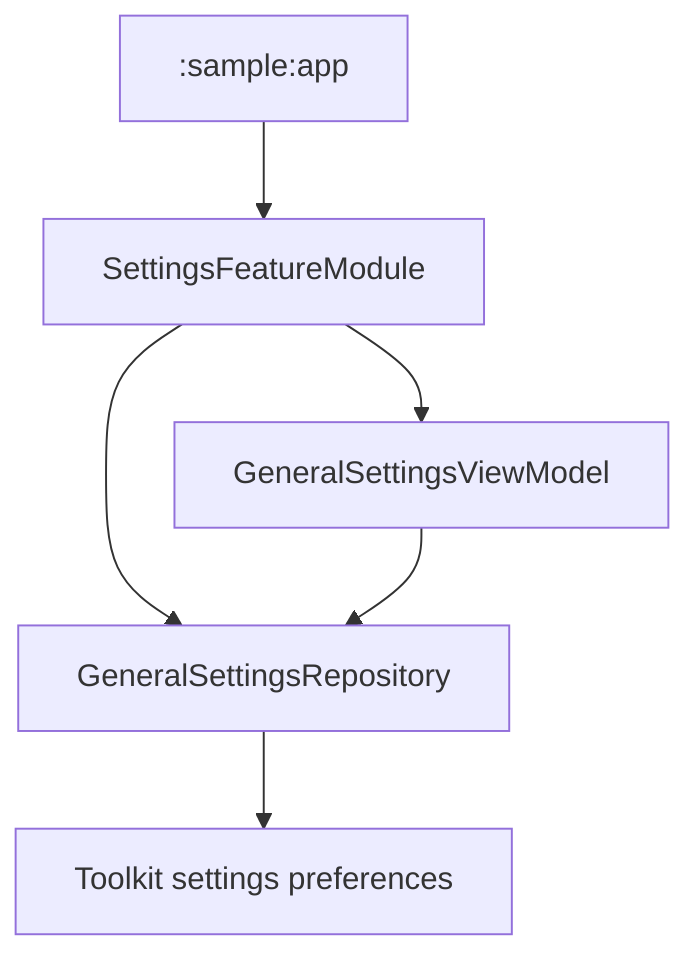

# `:sample:feature:settings` Logic Graph

## Purpose

Sample-owned General Settings repository and ViewModel bindings.

## Owns

- The sample binding for `GeneralSettingsRepository` and `GeneralSettingsViewModel`.

## Does not own

- The settings screens themselves, owned by [
  `:library:feature:settings`](../../../library/feature/settings/README.md).
- Host settings/startup provider implementations and their localized resources, owned by
  [`:sample:core:apptoolkit`](../../core/apptoolkit/README.md).
- App-specific About content and cross-feature callback wiring, owned by `:sample:app`.
- The unlock flag, owned by [`:sample:feature:components`](../components/README.md).

## Depends on

- [`:library:apptoolkit`](../../../library/apptoolkit/README.md) for the provider contracts.

## Used by

- `:sample:app`, whose general-settings Koin module supplies this content for the About content key.

## Flow chart

## Architectural decisions

- This feature binds sample runtime dependencies to reusable settings implementations.
- Cross-feature UI composition stays in the app module so this feature remains independent.
- No repository or data source is introduced here because the module owns no state or business rule.

## Public contracts

- `settingsFeatureModule`.

## Internal implementations

- General Settings repository and ViewModel construction.

## Current risks

This module wraps library-owned settings implementations. Changes to their constructor contracts
must be reflected in this binding module.
