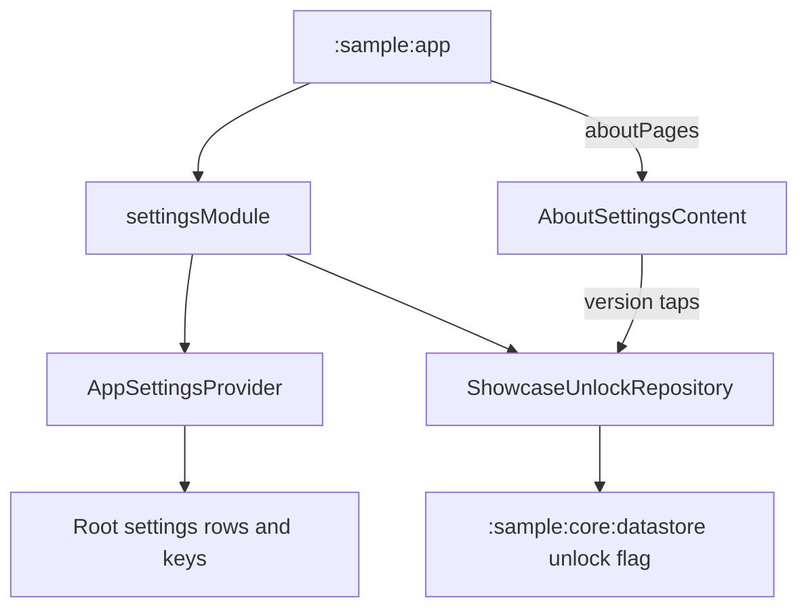

# `:sample:feature:settings` Logic Graph

## Purpose

The sample's root settings rows and the additions it supplies to the Toolkit: its About content
and the hidden version-tap gesture that content hosts.

## Owns

- `AppSettingsProvider`, the root settings categories, notification action, and Toolkit page keys.
- `SettingsConstants`, the stable keys of those rows.
- `AboutSettingsContent`, the sample's About page content, which `:sample:app` registers with
  `aboutPages { AboutSettingsContent() }`.
- `ShowcaseUnlockRepository`: the version-tap threshold and the write that persists the unlock,
  bound by `settingsModule`.

## Does not own

- The settings pages themselves, owned by
  [`:library:feature:settings`](../../../library/feature/settings/README.md) and the feature modules
  that register the keys the rows open.
- Startup, display, and About metadata providers, owned by the separate sample features.
- Toolkit module ordering, owned by [`:sample:core:apptoolkit`](../../core/apptoolkit/README.md).
- The showcase the gesture reveals, owned by
  [`:sample:feature:components`](../components/README.md), which only reads the same flag.
- The startup-screen choices, composed by `:sample:app`, which is the only module that may name
  every top-level destination.

## Depends on

- [`:library:apptoolkit`](../../../library/apptoolkit/README.md) for the About page and its
  extension.
- [`:sample:core:datastore`](../../core/datastore/README.md) for the persisted unlock flag.

## Used by

- `:sample:app`, which passes `settingsModule` to `appToolkitHostModules` and registers
  `AboutSettingsContent` as the About page.

## Flow chart

```mermaid
flowchart TD
    App[":sample:app"] --> Module[settingsModule]
    Module --> Provider[AppSettingsProvider]
    Provider --> Rows[Root settings rows and keys]
    Module --> Unlock
    App -->|aboutPages| About[AboutSettingsContent]
    About -->|version taps| Unlock[ShowcaseUnlockRepository]
    Unlock --> Store[":sample:core:datastore" unlock flag]
```

## Architectural decisions

- Feature providers stay with their owning sample feature. Settings, startup, display, and about
  are separated now so each area can expand without putting feature code back into core.
- This sample adapter intentionally has no `domain` package. Its only app-owned operation is a
  single repository mutation, so adding a forwarding use case would not isolate reusable logic.
- The About gesture lives with the settings that host it. It reaches the Components showcase
  through the shared flag in `:sample:core:datastore` rather than through the feature, so neither
  feature depends on its sibling and no registration contract is needed.
- The About content reaches the graph as an argument of `aboutPages`, not through a Koin binding,
  so there is no single binding a second module could silently override.

## Public contracts

- `settingsModule`, `AppSettingsProvider`, `SettingsConstants`, `AboutSettingsContent`,
  `ShowcaseUnlockRepository`.

## Internal implementations

- The tap-threshold rule.

## Current risks

The unlock threshold and the reader of the flag sit in different modules. Changing the flag's
meaning here without checking `:sample:feature:components` will silently change what that feature
shows.
