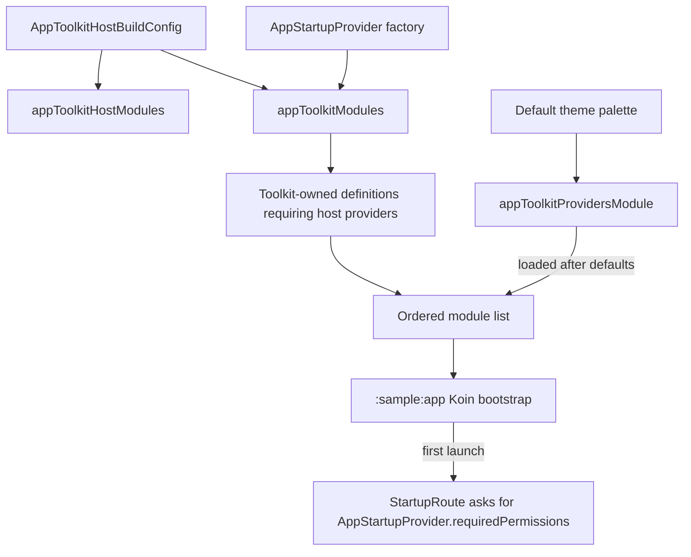

# `:sample:feature:startup` Logic Graph

## Purpose

Starts the sample on the App Toolkit: the Koin graph the application loads first, and the
permissions the first-launch startup screen asks for.

## Owns

- `appToolkitHostModules`, which orders the toolkit graph ahead of the host's own modules.
- `AppStartupProvider`, the sample's `StartupProvider`: notification permission on Android 13 and
  later, nothing before.
- The host-wide answers that belong to no single feature, currently the default theme palette.

## Does not own

- Toolkit provider contracts or default implementations, owned by `:library:feature:*` modules.
  The startup screen itself is [`:library:feature:startup`](../../../library/feature/startup/README.md)'s,
  the module this one mirrors.
- The onboarding pages, owned by [`:sample:feature:onboarding`](../onboarding/README.md).
- The sample's FAQ questions and answers, owned by [`:sample:feature:faq`](../faq/README.md).
- The settings, about, display, and privacy provider implementations, owned by
  [`:sample:feature:settings`](../settings/README.md) together with their Koin bindings. A feature
  may not depend on another, so the bindings travel with the classes.
- Deciding at launch whether startup runs, and the final Koin bootstrap, owned by
  [`:sample:app`](../../app/README.md).

## Depends on

- [`:library:apptoolkit`](../../../library/apptoolkit/README.md), exported because
  `appToolkitHostModules` names toolkit configuration and Koin types.

## Used by

- `:sample:app`, which calls `appToolkitHostModules` before adding app-specific modules.

## Flow chart

## Architectural decisions

- A feature, not a core module. It was `:sample:core:apptoolkit`, but it owns one flow, starting
  the app, rather than code that several features share, and nothing depends on it but the
  application.
- Toolkit modules are added before host bindings because Koin's later definitions win when the host
  intentionally replaces a toolkit binding; the ordering is part of `appToolkitHostModules`'
  contract.

## Public contracts

- `appToolkitHostModules` is the module's integration entry point. `AppStartupProvider` is bound
  through it.

## Internal implementations

- `appToolkitProvidersModule`, the palette binding.

## Current risks

Reversing module order lets duplicate toolkit definitions replace host choices. Adding a new
toolkit host extension also requires a binding here and an update to the host graph verification
tests; composable `koinInject()` lookups need direct resolution tests because constructor reflection
cannot discover them.
