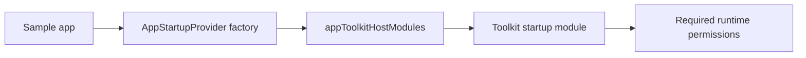

# `:sample:feature:startup` Logic Graph

## Purpose

Supplies the sample's permission policy to the Toolkit startup screen.

## Owns

- `AppStartupProvider`, which requests notification permission on Android 13 and later and no
  runtime permissions on earlier versions.

## Does not own

- Startup UI, permission handling, consent, and the transition to onboarding, owned by
  [`:library:feature:startup`](../../../library/feature/startup/README.md).
- First-launch decisions and the final provider wiring, owned by `:sample:app`.
- Toolkit module ordering, owned by `:sample:core:apptoolkit`.

## Depends on

- `:library:feature:startup` for `StartupProvider` and its exported dependencies.

## Used by

- `:sample:app`, which passes `::AppStartupProvider` to `appToolkitHostModules`.

## Flow chart

## Architectural decisions

Startup has a separate sample feature so future permission policy or startup customization can
expand here without changing core ownership. It uses the Toolkit screen and adds no duplicate UI.
The feature has no dependency on another sample feature or the app.

## Public contracts

- `AppStartupProvider`, used as a factory for the Toolkit's startup binding.

## Current risks

Changes to the permission list must match the final application manifest and runtime behavior.
The published application identity and existing startup flow remain unchanged.
