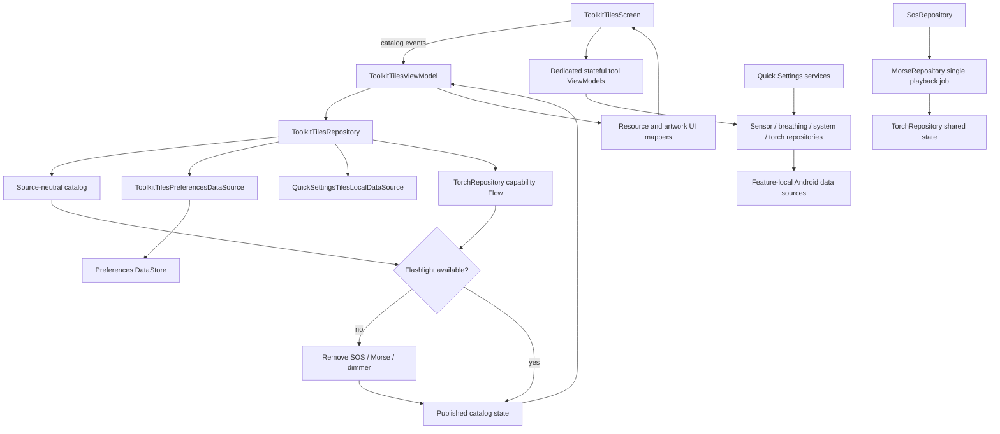

# `:sample:feature:tiles` Logic Graph

## Purpose

Quick tools: the in-app tool catalogue and the Quick Settings tile services behind it.

## Owns

- `ToolkitTilesRepository`, which owns the source-neutral catalogue and coordinates current tile
  status with persisted category expansion preferences.
- Local data sources for preferences, Quick Settings, sensors/display, haptics, and
  torch access.
- `SensorRepository`, `BreathingRepository`, `TorchRepository`, `MorseRepository`, and
  `SosRepository`, which remain the data-layer entry points and own coordination or runtime state.
- UI catalogue models and mappers, the screen and dedicated tool ViewModels, tool composables,
  `toolkitTilesEntryBuilder`, and the Quick Settings services.
- Localized Quick Tools strings and plurals.
- Feature-owned manifest permissions for haptics and flashlight access. The feature
  declares no foreground service and no wake locks.

## Does not own

- The route key it registers against, owned by
  [`:sample:core:navigation`](../../core/navigation/README.md).
- Native ad rendering, owned by [`:library:core:ui`](../../../library/core/ui/README.md); this
  module supplies only the quick-tools card styling.

## Depends on

- `:sample:core:navigation`, `:sample:core:common`, `:sample:core:ui`.
- [`:library:apptoolkit`](../../../library/apptoolkit/README.md) for ad slots and screen contracts.

## Used by

- `:sample:app`, for DI and the navigation graph.

## Flow chart

## Architectural decisions

- Repositories are the only entry points to platform-backed sources; ViewModels and framework
  services do not call sensor, torch, haptics, or settings sources directly.
- The catalog is source-neutral. Resource IDs, icons, descriptions, and ad styling are mapped in the
  UI layer after availability filtering.
- Torch state is shared because in-app tools and system-created services can operate concurrently.
  One Morse playback job serializes patterned output, and SOS delegates to it.
- Only stateful/platform-backed tools receive dedicated ViewModels; stateless decision tools remain
  local UI behavior rather than creating pass-through layers.

## Public contracts

- `ToolkitTilesRepository`, `TorchRepository`, `MorseRepository`, `ToolkitTilesViewModel`, the
  dedicated tool ViewModels, `toolkitTilesEntryBuilder`, and the source-neutral tile models.

## Internal implementations

- Camera2 torch discovery/control, sensor sampling, haptics, Quick Settings inspection, UI
  catalogue mapping, and tool composables.

## Source ownership and risks

Android platform APIs are isolated in `data/local` sources. ViewModels and services use
repositories as the data-layer entry points, while source interfaces provide deterministic test
boundaries around external resources.

`ToolkitTilesRepository` removes SOS, Morse and Flash Dimmer from the published catalogue when the
shared torch capability reports that no flashlight is available. Catalogue resource IDs and
artwork identifiers live in UI models and mappers; the repository publishes only source-neutral
IDs, status, behavior kind, and platform request keys.

`TorchRepository` has a contract because Morse/SOS, the in-app dimmer and a system-created Quick
Settings service share one observable source of truth. `MorseRepository` owns the only patterned
torch playback job; SOS delegates its fixed message to it so custom Morse, SOS and steady
brightness controls cannot compete. Torch strength is exposed on Android 13+ when hardware reports
multiple levels; older and single-level devices fall back to a binary toggle.

## Migration notes

The catalogue and status pass formerly lived in pass-through use cases. They remain repository
work, while all Android resource and artwork mapping now happens in the UI layer. Stateful or
platform-backed bottom-sheet tools retain dedicated ViewModels; the catalogue ViewModel owns only
catalogue, filter, expansion, ad and add/setup state.

### Quick Settings membership and Android versions

`NotAdded` means an unpinned Quick Settings service on Android 13+, where the system add-tile
request is supported. In-app sensor tools remain available. Older versions omit the add action and
the filter, and retain the Tile-ready tools instructions for manually editing Quick Settings.
The helper card reuses those localized instructions rather than describing missing tool functionality.

Membership normalizes Android's custom tile component format. When secure settings are unavailable,
system tile lifecycle callbacks and successful pin results supply locally recorded membership.
The open tool sheet refreshes after pin requests.

No tool here runs in the background. Every tool works while its sheet is open, which keeps the
feature free of foreground services, wake locks, and the Play Console declarations they carry.
