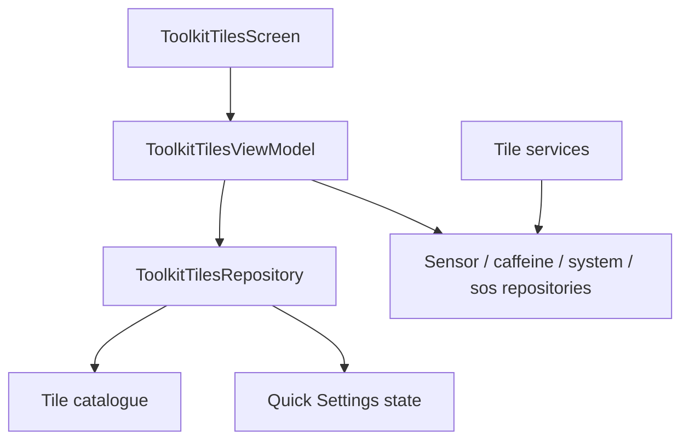

# `:sample:feature:tiles` Logic Graph

## Purpose

Quick tools: the in-app tool catalogue and the Quick Settings tile services behind it.

## Owns

- `ToolkitTilesRepository` and `DefaultToolkitTilesRepository`, which own the tile catalogue and read
  which tiles are added to Quick Settings.
- The platform-wrapping repositories: `SensorRepository`, `BreathingRepository`, `CaffeineRepository`,
  `SystemRepository`, `SosRepository`.
- `ToolkitTilesViewModel`, the tool composables, the bottom sheet, and `toolkitTilesEntryBuilder`.
- The Quick Settings tile services and `CaffeineService`.

## Does not own

- The route key it registers against, owned by [`:sample:core:navigation`](../../core/navigation/README.md).
- Native ad rendering, owned by [`:library:core:ui`](../../../library/core/ui/README.md); this module
  supplies only the quick-tools card styling.

## Depends on

- `:sample:core:navigation`, `:sample:core:common`, `:sample:core:ui`.
- [`:library:apptoolkit`](../../../library/apptoolkit/README.md) for ad slots and screen contracts.

## Used by

- `:sample:app`, for DI and the navigation graph.

## Flow chart

## Public contracts

- `ToolkitTilesRepository`, `ToolkitTilesViewModel`, `toolkitTilesEntryBuilder`, the tile models.

## Internal implementations

- Sensor sampling, the caffeine foreground service, ringer-mode cycling, tool composables.

## Current risks

The platform repositories stay concrete classes with no interface. Each wraps one Android source and
has no alternate implementation, so an interface would add substitution nobody uses — but it also
means those paths cannot be faked in a unit test.

`ToolkitTilesRepository` is the exception and has a contract, because it serves the catalogue as well
as reading the platform.

## Migration notes

The catalogue was `GetToolkitTilesUseCase` and the status pass was `SyncToolkitTileStatusesUseCase`.
Neither was a use case — one was a hardcoded data set in the domain layer, the other read the
repository and mapped over the result — so both moved into the repository, where `tileCategories()`
now applies statuses itself.

`CaffeineService` used to build its notification intent from `MainActivity::class.java`. It resolves
the launcher activity through the package manager instead, so a quick-tool service does not depend on
the application module.
