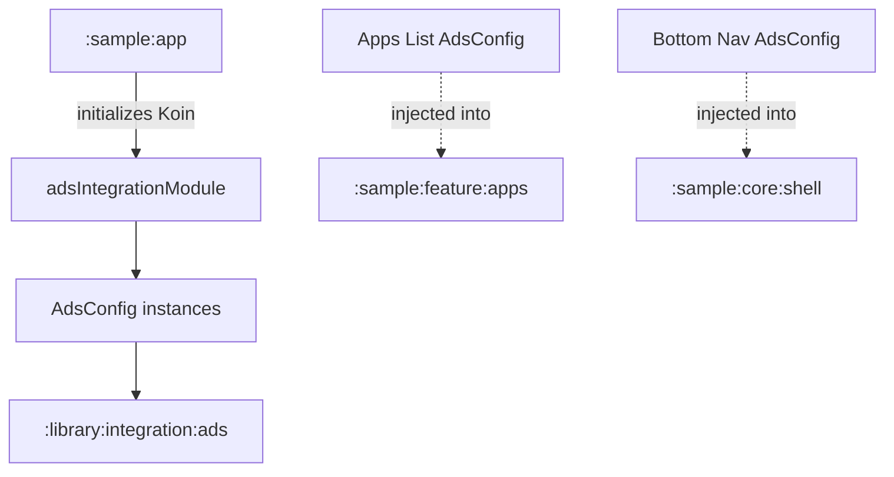

# `:sample:integration:ads` Logic Graph

## Purpose

Centralizes the Ad configuration for the sample app, bridging specific Ad Unit IDs to the App
Toolkit's Ad infrastructure. This module serves as an integration layer between the sample app's
logic and the toolkit's advertising components.

## Owns

- `adsIntegrationModule`, which defines the `AdsConfig` instances for different surfaces (Apps List,
  App Details, Bottom Nav, etc.).
- `AdsConstants` (the sample's ad unit IDs, debug/release selection and ad frequency) and
  `AppAdsQualifiers` (the placements this app adds beyond the toolkit's own).

## Depends on

- [`:library:apptoolkit`](../../../library/apptoolkit/README.md) for the `AdsConfig` model and
  `AdsQualifiers`.

## Used by

- `:sample:app` to compose the DI graph and to read `AdsConstants.APP_OPEN_UNIT_ID`.
- `:sample:feature:apps` and `:sample:feature:tiles`, for their placement qualifiers and unit IDs.
- Various features in the sample app via the library's Ad components (which inject the `AdsConfig`
  provided here).

## Flow chart

## Architectural decisions

- **Decentralized Configuration**: Ad Unit IDs are maintained in the sample's `core:common` and
  mapped to library contracts in this integration module.
- **Qualifier-based Injection**: Uses Koin's `named` qualifiers to provide different ad
  configurations for different UI contexts.

## Host requirements

The host app declares the `com.google.android.gms.ads.APPLICATION_ID` meta-data and the
`ad_mob_app_id` resource it resolves (see `:sample:app`). That pair is the app's publisher identity
rather than configuration of this module, and the toolkit's `AdMobAppIdProvider` reads it from the
merged manifest. Declaring either here would leak one account into every consumer that does not
happen to override the same resource name.

## Public contracts

The module binds seven placements: general native, no-data, bottom navigation, Help, Support, Apps
List, and App Details. `AdsIntegrationModuleTest` resolves every qualifier and rejects blank unit
IDs, while the app graph test verifies this module is part of runtime composition.
