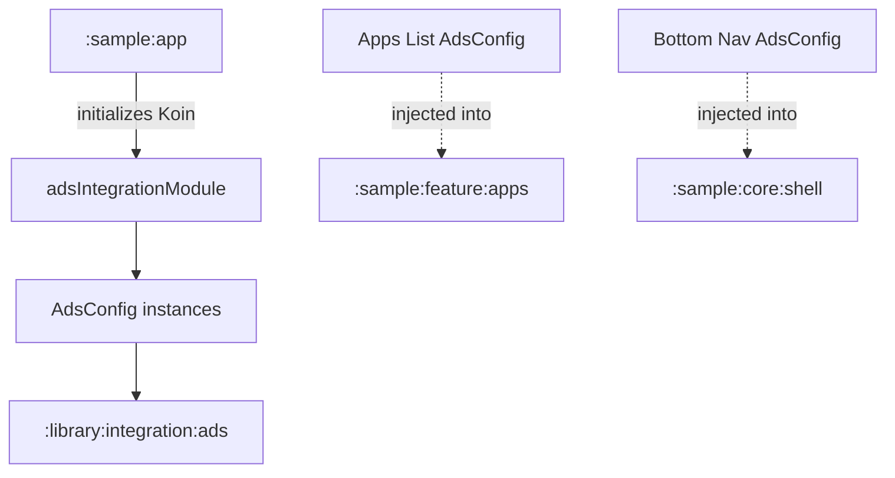

# `:sample:integration:ads` Logic Graph

## Purpose

Centralizes the Ad configuration for the sample app, bridging specific Ad Unit IDs to the App
Toolkit's Ad infrastructure. This module serves as an integration layer between the sample app's
logic and the toolkit's advertising components.

## Owns

- `adsIntegrationModule`, which defines the `AdsConfig` instances for different surfaces (Apps List,
  App Details, Bottom Nav, etc.).
- `AdsConstants` (the sample's ad unit IDs, debug/release selection and ad frequency) and
  `AppAdsQualifiers` (the placements this app adds beyond the toolkit's own).
- The sample app's AdMob application ID and the manifest meta-data that publishes it to the merged
  application manifest.

## Depends on

- [`:library:apptoolkit`](../../../library/apptoolkit/README.md) for the `AdsConfig` model and
  `AdsQualifiers`.

## Used by

- `:sample:app` to compose the DI graph and to read `AdsConstants.APP_OPEN_UNIT_ID`.
- `:sample:feature:apps` and `:sample:feature:tiles`, for their placement qualifiers and unit IDs.
- Various features in the sample app via the library's Ad components (which inject the `AdsConfig`
  provided here).

## Flow chart

## Architectural decisions

- **Advertising ownership**: Ad unit IDs and placement qualifiers are maintained in this integration module and mapped to library contracts here.
- **Qualifier-based Injection**: Uses Koin's `named` qualifiers to provide different ad
  configurations for different UI contexts.

## Manifest contribution

This sample-specific integration module contributes the
`com.google.android.gms.ads.APPLICATION_ID` meta-data and its `ad_mob_app_id` resource to the final
sample APK. The toolkit's `AdMobAppIdProvider` reads that value from the merged manifest. Keeping
the
pair here places all of the sample's advertising configuration in one module; the reusable
`:library:integration:ads` module still provides no publisher identity or fallback value.

## Public contracts

The module binds seven placements: general native, no-data, bottom navigation, Help, Support, Apps
List, and App Details. `AdsIntegrationModuleTest` resolves every qualifier and rejects blank unit
IDs, while the app graph test verifies this module is part of runtime composition.
