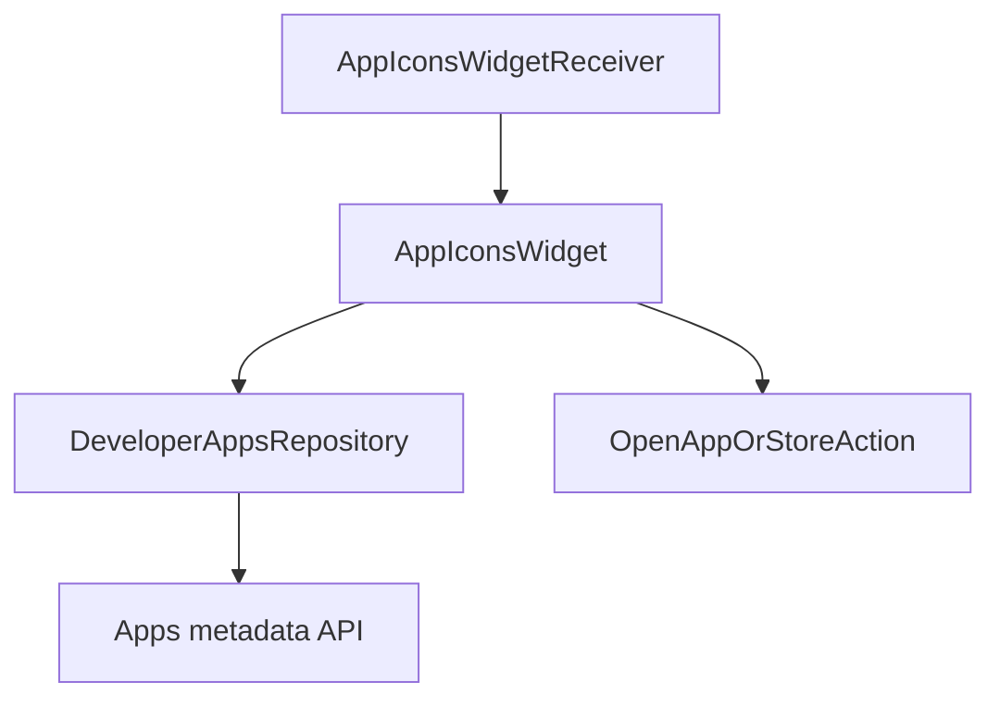

# `:sample:widget` Logic Graph

## Purpose

The home-screen app-icons widget.

## Owns

- `AppIconsWidget` and `AppIconsWidgetReceiver`.
- `OpenAppOrStoreAction`, which opens an installed app or falls back to its store listing.

## Does not own

- The app catalogue it renders, owned by [`:sample:feature:apps`](../feature/apps/README.md).
- The widget's provider `xml/` and its manifest receiver entry, currently declared in `:sample:app`.

## Depends on

- `:sample:feature:apps` for `DeveloperAppsRepository` and `AppInfo`.
- `:sample:core:ui` for the widget's layouts, drawables and strings.
- [`:library:apptoolkit`](../../library/apptoolkit/README.md) for Glance and `DataState`.

## Used by

- `:sample:app`.

## Flow chart

## Public contracts

- `AppIconsWidget`, `AppIconsWidgetReceiver`, `OpenAppOrStoreAction`.

## Internal implementations

- Glance layout, loading and error states, icon fetching.

## Current risks

The widget resolves its repository through `GlobalContext` rather than constructor injection, because
a Glance widget is instantiated by the framework. That hides the dependency from the type system: the
widget compiles even if the binding is removed and fails at runtime instead.

The receiver is still declared in the application manifest rather than this module's, so adding the
widget to a host means editing `:sample:app` too.
