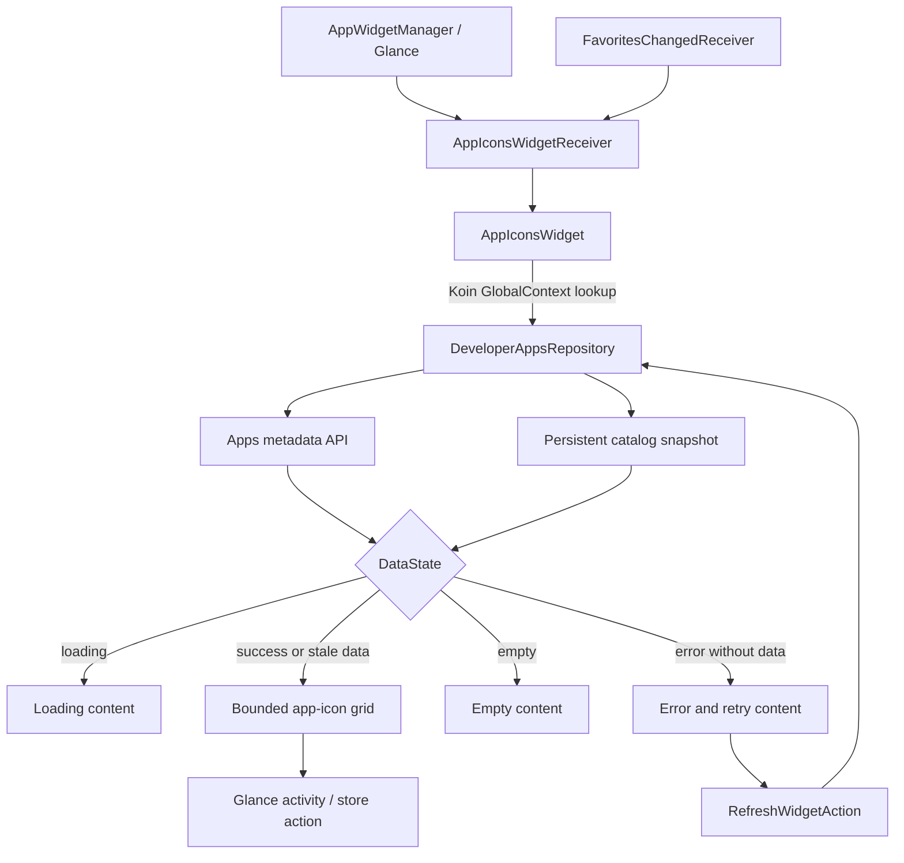

# `:sample:widget` Logic Graph

## Purpose

The home-screen app-icons widget.

## Owns

- `AppIconsWidget` and `AppIconsWidgetReceiver`.
- `RefreshWidgetAction`, which retries an unsuccessful catalogue load through Glance's action
  worker.
- The widget's localized strings and fallback layouts.

## Does not own

- The app catalogue it renders, owned by [`:sample:feature:apps`](../feature/apps/README.md).
- The widget's provider `xml/` and its manifest receiver entry, currently declared in `:sample:app`.

## Depends on

- `:sample:feature:apps` for `DeveloperAppsRepository` and `AppInfo`.
- [`:library:apptoolkit`](../../library/apptoolkit/README.md) for Glance and `DataState`.

## Used by

- `:sample:app`.

## Flow chart

## Architectural decisions

- The widget consumes the same repository and persistent fallback as the apps screen, preventing a
  second catalog source of truth.
- Framework construction prevents constructor injection, so the repository lookup is isolated at
  the widget boundary and protected by host graph tests.
- Loading, empty, stale-success, and error states render independently; retry is a Glance action so
  it can run outside an activity.
- Icon work is bounded to the visible widget capacity to avoid unbounded network/bitmap work during
  an update.

## Public contracts

- `AppIconsWidget`, `AppIconsWidgetReceiver`, `RefreshWidgetAction`.

## Internal implementations

- Glance layout, explicit loading/empty/error states, bounded icon fetching, and app/store intent
  selection.
- Glance unit tests for standalone state content and retry presentation.

## Current risks

The widget resolves its repository through `GlobalContext` rather than constructor injection,
because
a Glance widget is instantiated by the framework. That hides the dependency from the type system:
the
widget compiles even if the binding is removed and fails at runtime instead.

The receiver is still declared in the application manifest rather than this module's, so adding the
widget to a host means editing `:sample:app` too.
